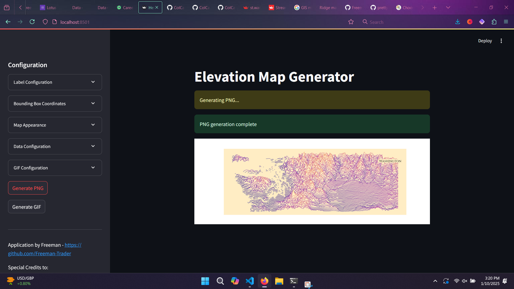

### Height Map Generator Web Application

## Getting Started

1. **Install Python and pip**:
   - Ensure that `python3` and `pip3` are installed in the environment where you want to host the web application.

2. **Navigate to the Project Directory**:
   - Change your working directory to the parent directory of this file.

3. **Install Dependencies**:
   - Run the following command to install the required dependencies:
     ```bash
     pip install -r requirements.txt
     ```

4. **Run the Application**:
   - Start the application using Streamlit:
     ```bash
     streamlit run Height_Map.py
     ```

5. **Access the Application**:
   - Open your browser and visit:
     [https://localhost:8501](https://localhost:8501)
   - The application should look something like this:
     

6. **Start Creating Height Maps**:
   - Experiment and create your own height maps!

## Examples

Here are some examples of generated height map GIFs and PNGs:

- **My Personal Favorite**:
  

- **A Close Second**:
  

- **A Really Big One**:
  
  
- **Different Properties**:
  
